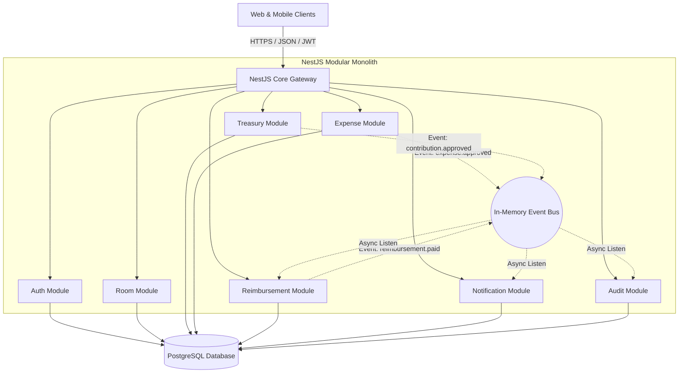
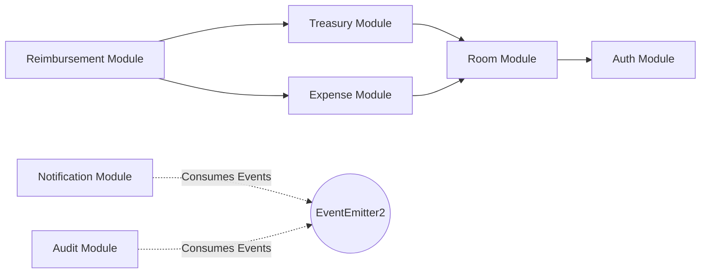

# HisaabSync - System Architecture v1

## 1. Architectural Philosophy: Modular Monolith

HisaabSync is architected as a **Modular Monolith** built on **NestJS, TypeScript, PostgreSQL, and Prisma ORM**.

### Why Modular Monolith for V1?
1. **Accelerated Time-to-Market**: Eliminates distributed system complexities (distributed tracing, network latency, saga orchestrators) in early stages.
2. **Simplified ACID Transactions**: Crucial for financial accounting—enables single-database transactions (`prisma.$transaction`) across ledger operations without 2-phase commit overhead.
3. **Strict Domain Boundaries**: Modules are organized with zero cross-table direct queries, allowing clean extraction into standalone microservices (e.g. Notification Service, Treasury Service) in V2.



---

## 2. Layered Clean Architecture Inside Each Module

Each domain module follows strict **Clean / Onion Architecture** separation:

```
src/modules/<module-name>/
├── controllers/          # Presentation Layer (HTTP routing, status codes, Swagger)
├── dto/                  # Data Transfer Objects & Validation (class-validator)
├── services/             # Application / Use Case Layer (Business rules orchestration)
├── repositories/         # Infrastructure Layer (Prisma ORM database queries)
├── entities/             # Domain Entities & Interfaces
├── events/               # Domain Event definitions & Event Handlers
└── <module-name>.module.ts # NestJS Module definition
```

### Architectural Rules:
1. **Controllers**: Pure presentation. Must only parse input, invoke services, and return responses. No business logic or database queries allowed.
2. **Services**: Encapsulate all business rules, calculations, and domain event emissions.
3. **Repositories**: Abstract all Prisma database queries. Services never use Prisma Client directly.
4. **Cross-Module Coupling**: Direct cross-module database joins are forbidden. Modules interact only via exported Service Interfaces or Domain Events (`@OnEvent`).

---

## 3. Inter-Module Dependency Graph



---

## 4. Financial Concurrency & Transaction Management

Financial accuracy is non-negotiable. HisaabSync implements **Pessimistic Row Locking** and **Atomic Database Transactions** for all ledger modifications.

### 1. Contribution Approval Flow
```ts
await prisma.$transaction(async (tx) => {
  // 1. Lock contribution row
  const contribution = await tx.contribution.findUniqueOrThrow({ where: { id } });
  if (contribution.status !== 'PENDING') throw new ConflictException('Already processed');
  
  // 2. Mark contribution approved
  await tx.contribution.update({ where: { id }, data: { status: 'APPROVED', approvedBy, approvedAt: new Date() } });

  // 3. Write immutable credit entry into ledger
  await tx.treasuryTransaction.create({
    data: {
      roomId: contribution.roomId,
      transactionType: 'CREDIT',
      referenceType: 'CONTRIBUTION',
      referenceId: contribution.id,
      amount: contribution.amount,
      description: `Contribution from user ${contribution.contributorId}`,
      createdBy: approvedBy,
    }
  });

  // 4. Atomically increment materialized treasury balance
  await tx.treasuryAccount.update({
    where: { roomId: contribution.roomId },
    data: { currentBalance: { increment: contribution.amount } }
  });
});
```

### 2. Reimbursement Payout (Strict vs Flexible Mode)
```ts
await prisma.$transaction(async (tx) => {
  // 1. Lock room settings & treasury account row
  const treasury = await tx.treasuryAccount.findUniqueOrThrow({ where: { roomId } });
  const settings = await tx.roomSettings.findUniqueOrThrow({ where: { roomId } });
  const reimbursement = await tx.reimbursement.findUniqueOrThrow({ where: { id } });

  if (reimbursement.status !== 'PENDING_PAYMENT') throw new ConflictException('Already paid');

  // 2. Check balance in Strict Mode
  if (!settings.allowNegativeTreasury && treasury.currentBalance.lessThan(reimbursement.amount)) {
    throw new BadRequestException('TREASURY_INSUFFICIENT_BALANCE');
  }

  // 3. Mark reimbursement paid
  await tx.reimbursement.update({ where: { id }, data: { status: 'PAID', paidBy, paidAt: new Date() } });

  // 4. Write immutable debit entry into ledger
  await tx.treasuryTransaction.create({
    data: {
      roomId,
      transactionType: 'DEBIT',
      referenceType: 'REIMBURSEMENT',
      referenceId: reimbursement.id,
      amount: reimbursement.amount,
      description: `Reimbursement paid to user ${reimbursement.beneficiaryId}`,
      createdBy: paidBy,
    }
  });

  // 5. Decrement materialized treasury balance
  await tx.treasuryAccount.update({
    where: { roomId },
    data: { currentBalance: { decrement: reimbursement.amount } }
  });
});
```

---

## 5. Security & Infrastructure Architecture

### Authentication & Authorization
- **Authentication**: Stateless JWT with short expiration (15m) + secure Refresh Token rotation (7d) stored hashed in PostgreSQL.
- **Authorization**: Granular Room-Based Role Access Control (RBAC) via NestJS Guards:
  - `JwtAuthGuard`: Authenticates global user identity.
  - `RoomMemberGuard`: Validates active membership within the target `:roomId`.
  - `RolesGuard`: Verifies role permissions (`ADMIN`, `ACCOUNTANT`, `MEMBER`).

### Defensive Middleware & Hardening
- **Helmet**: Secures HTTP response headers.
- **CORS**: Restricts API calls to authorized frontend domains.
- **Rate Limiting**: `@nestjs/throttler` protects sensitive endpoints (login, register, payment actions).
- **Validation**: Global `ValidationPipe` with `whitelist: true, forbidNonWhitelisted: true, transform: true`.

---

## 6. Observability & Health Monitoring

- **Structured Logging**: JSON logging with request `correlationId` to trace multi-step business transactions.
- **Health Check Endpoint**: `/health` leveraging `@nestjs/terminus` to monitor database connectivity and memory limits.
- **Audit Logging**: Automatic background recording of administrative and financial state modifications.

---

## 7. Future Microservice Extraction Roadmap (V2)

```mermaid
graph TD
    API_Gateway[API Gateway / Envoy / Kong]
    
    subgraph Microservices[Extracted Microservices]
        Auth_Svc[Auth Service (gRPC/REST)]
        Room_Svc[Room & Treasury Service]
        Expense_Svc[Expense & Reimbursement Service]
        Notif_Svc[Notification & WhatsApp Worker]
        Audit_Svc[Audit & Compliance Service]
    end

    Message_Broker[(RabbitMQ / Redis Streams)]
    
    API_Gateway --> Auth_Svc
    API_Gateway --> Room_Svc
    API_Gateway --> Expense_Svc
    
    Room_Svc --> Message_Broker
    Expense_Svc --> Message_Broker
    
    Message_Broker --> Notif_Svc
    Message_Broker --> Audit_Svc
```