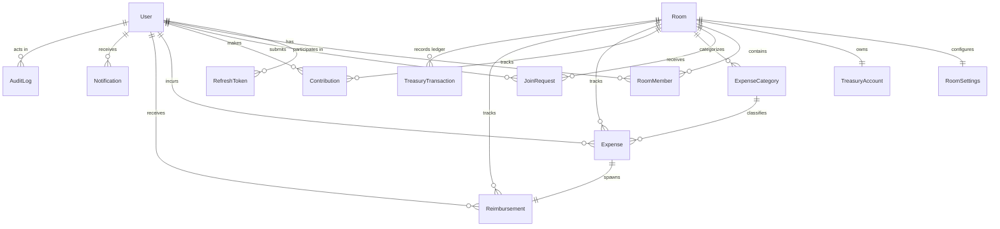

# HisaabSync - Database Design & Schema Specification v1

## 1. Database Overview & Technology Stack

- **Database Engine**: PostgreSQL 15+
- **Database Name**: `hisaabsync_db`
- **ORM**: Prisma ORM
- **Primary Key Strategy**: UUIDv4 (`gen_random_uuid()`)
- **Financial Precision**: `DECIMAL(12, 2)` (supports up to ₹9,999,999,999.99)
- **Timezone**: UTC (`TIMESTAMPTZ` / `TIMESTAMP WITH TIME ZONE`)

---

## 2. Entity-Relationship (ER) Diagram



---

## 3. Detailed Table Schemas

### 1. `users`
System user identities.

| Column | Type | Constraints | Description |
|---|---|---|---|
| `id` | UUID | PK, DEFAULT uuid_generate_v4() | Unique User ID |
| `full_name` | VARCHAR(100) | NOT NULL | User's full name |
| `email` | VARCHAR(255) | UNIQUE, NOT NULL | Unique login email |
| `phone` | VARCHAR(20) | NULL | Optional phone number |
| `password_hash` | TEXT | NOT NULL | Bcrypt hashed password |
| `profile_image_url` | TEXT | NULL | Avatar URL |
| `is_active` | BOOLEAN | NOT NULL, DEFAULT true | Account status |
| `created_at` | TIMESTAMPTZ | NOT NULL, DEFAULT NOW() | Registration timestamp |
| `updated_at` | TIMESTAMPTZ | NOT NULL, DEFAULT NOW() | Last update timestamp |

---

### 2. `refresh_tokens`
JWT refresh token management with token rotation.

| Column | Type | Constraints | Description |
|---|---|---|---|
| `id` | UUID | PK, DEFAULT uuid_generate_v4() | Token record ID |
| `user_id` | UUID | FK -> `users(id)` ON DELETE CASCADE | Target user |
| `token_hash` | TEXT | NOT NULL | SHA-256 / Bcrypt hash of token |
| `expires_at` | TIMESTAMPTZ | NOT NULL | Expiry timestamp |
| `created_at` | TIMESTAMPTZ | NOT NULL, DEFAULT NOW() | Creation timestamp |

---

### 3. `rooms`
Treasury management rooms / flat groups.

| Column | Type | Constraints | Description |
|---|---|---|---|
| `id` | UUID | PK, DEFAULT uuid_generate_v4() | Unique Room ID |
| `name` | VARCHAR(100) | NOT NULL | Display name |
| `room_code` | VARCHAR(20) | UNIQUE, NOT NULL | Unique invite code (e.g. `FLAT402`) |
| `description` | TEXT | NULL | Optional description |
| `status` | VARCHAR(20) | NOT NULL, DEFAULT 'ACTIVE' | `ACTIVE`, `ARCHIVED` |
| `created_by` | UUID | FK -> `users(id)` ON DELETE RESTRICT | Creator user ID |
| `created_at` | TIMESTAMPTZ | NOT NULL, DEFAULT NOW() | Room creation timestamp |
| `updated_at` | TIMESTAMPTZ | NOT NULL, DEFAULT NOW() | Last update timestamp |

---

### 4. `room_settings`
Configurable behavior per room.

| Column | Type | Constraints | Description |
|---|---|---|---|
| `id` | UUID | PK, DEFAULT uuid_generate_v4() | Settings ID |
| `room_id` | UUID | UNIQUE, FK -> `rooms(id)` ON DELETE CASCADE | 1:1 Room reference |
| `currency_code` | VARCHAR(10) | NOT NULL, DEFAULT 'INR' | Default ISO currency code |
| `allow_negative_treasury` | BOOLEAN | NOT NULL, DEFAULT false | Strict (`false`) vs Flexible (`true`) |
| `require_expense_approval` | BOOLEAN | NOT NULL, DEFAULT true | Approval required before payout |
| `require_contribution_approval` | BOOLEAN | NOT NULL, DEFAULT true | Approval required before ledger credit |
| `auto_create_reimbursement` | BOOLEAN | NOT NULL, DEFAULT true | Auto-generate reimbursement on approval |
| `created_at` | TIMESTAMPTZ | NOT NULL, DEFAULT NOW() | Timestamp |
| `updated_at` | TIMESTAMPTZ | NOT NULL, DEFAULT NOW() | Timestamp |

---

### 5. `room_members`
User membership and roles within a room.

| Column | Type | Constraints | Description |
|---|---|---|---|
| `id` | UUID | PK, DEFAULT uuid_generate_v4() | Membership ID |
| `room_id` | UUID | FK -> `rooms(id)` ON DELETE CASCADE | Room ID |
| `user_id` | UUID | FK -> `users(id)` ON DELETE CASCADE | User ID |
| `role` | VARCHAR(20) | NOT NULL, DEFAULT 'MEMBER' | `ADMIN`, `ACCOUNTANT`, `MEMBER` |
| `status` | VARCHAR(30) | NOT NULL, DEFAULT 'ACTIVE' | `ACTIVE`, `PENDING_APPROVAL`, `LEAVE_REQUESTED`, `LEFT` |
| `joined_at` | TIMESTAMPTZ | NOT NULL, DEFAULT NOW() | Joined timestamp |
| `left_at` | TIMESTAMPTZ | NULL | Deactivation / leave timestamp |
| `created_at` | TIMESTAMPTZ | NOT NULL, DEFAULT NOW() | Record creation |
| `updated_at` | TIMESTAMPTZ | NOT NULL, DEFAULT NOW() | Record update |

*Unique Constraint*: `UNIQUE (room_id, user_id)`

---

### 6. `join_requests`
Room join approval workflow.

| Column | Type | Constraints | Description |
|---|---|---|---|
| `id` | UUID | PK, DEFAULT uuid_generate_v4() | Request ID |
| `room_id` | UUID | FK -> `rooms(id)` ON DELETE CASCADE | Target Room |
| `user_id` | UUID | FK -> `users(id)` ON DELETE CASCADE | Requesting User |
| `status` | VARCHAR(20) | NOT NULL, DEFAULT 'PENDING' | `PENDING`, `APPROVED`, `REJECTED` |
| `rejection_reason` | TEXT | NULL | Reason if rejected |
| `reviewed_by` | UUID | NULL, FK -> `users(id)` ON DELETE SET NULL | Admin who reviewed |
| `reviewed_at` | TIMESTAMPTZ | NULL | Timestamp of review |
| `created_at` | TIMESTAMPTZ | NOT NULL, DEFAULT NOW() | Submission timestamp |

---

### 7. `treasury_accounts`
Materialized treasury pool balance.

| Column | Type | Constraints | Description |
|---|---|---|---|
| `id` | UUID | PK, DEFAULT uuid_generate_v4() | Treasury Account ID |
| `room_id` | UUID | UNIQUE, FK -> `rooms(id)` ON DELETE CASCADE | 1:1 Room reference |
| `current_balance` | DECIMAL(12,2) | NOT NULL, DEFAULT 0.00 | High-performance cached balance |
| `created_at` | TIMESTAMPTZ | NOT NULL, DEFAULT NOW() | Creation timestamp |
| `updated_at` | TIMESTAMPTZ | NOT NULL, DEFAULT NOW() | Balance update timestamp |

---

### 8. `treasury_transactions`
The immutable double-entry ledger. **Single source of financial truth.**

| Column | Type | Constraints | Description |
|---|---|---|---|
| `id` | UUID | PK, DEFAULT uuid_generate_v4() | Transaction ID |
| `room_id` | UUID | FK -> `rooms(id)` ON DELETE RESTRICT | Room Reference |
| `transaction_type` | VARCHAR(20) | NOT NULL | `CREDIT`, `DEBIT` |
| `reference_type` | VARCHAR(30) | NOT NULL | `CONTRIBUTION`, `REIMBURSEMENT`, `ADJUSTMENT` |
| `reference_id` | UUID | NULL | Originating Entity ID |
| `amount` | DECIMAL(12,2) | NOT NULL | Positive monetary amount |
| `description` | TEXT | NOT NULL | Transaction explanation |
| `created_by` | UUID | FK -> `users(id)` ON DELETE RESTRICT | Actor who initiated/approved |
| `created_at` | TIMESTAMPTZ | NOT NULL, DEFAULT NOW() | Immutable transaction timestamp |

---

### 9. `contributions`
Member fund deposits into the shared treasury.

| Column | Type | Constraints | Description |
|---|---|---|---|
| `id` | UUID | PK, DEFAULT uuid_generate_v4() | Contribution ID |
| `room_id` | UUID | FK -> `rooms(id)` ON DELETE RESTRICT | Room Reference |
| `contributor_id` | UUID | FK -> `users(id)` ON DELETE RESTRICT | Depositing Member |
| `amount` | DECIMAL(12,2) | NOT NULL | Contribution Amount |
| `note` | TEXT | NULL | Note or reference info |
| `status` | VARCHAR(20) | NOT NULL, DEFAULT 'PENDING' | `PENDING`, `APPROVED`, `REJECTED`, `CANCELLED` |
| `rejection_reason` | TEXT | NULL | Reason if rejected |
| `approved_by` | UUID | NULL, FK -> `users(id)` ON DELETE SET NULL | Approver User ID |
| `approved_at` | TIMESTAMPTZ | NULL | Approval timestamp |
| `created_at` | TIMESTAMPTZ | NOT NULL, DEFAULT NOW() | Submission timestamp |
| `updated_at` | TIMESTAMPTZ | NOT NULL, DEFAULT NOW() | Status update timestamp |

---

### 10. `expense_categories`
Room expense categorization.

| Column | Type | Constraints | Description |
|---|---|---|---|
| `id` | UUID | PK, DEFAULT uuid_generate_v4() | Category ID |
| `room_id` | UUID | FK -> `rooms(id)` ON DELETE CASCADE | Room Reference |
| `name` | VARCHAR(100) | NOT NULL | Category name |
| `is_default` | BOOLEAN | NOT NULL, DEFAULT false | System default flag |
| `created_at` | TIMESTAMPTZ | NOT NULL, DEFAULT NOW() | Creation timestamp |

*Constraint*: `UNIQUE (room_id, name)`

---

### 11. `expenses`
Shared expenses paid out-of-pocket by members.

| Column | Type | Constraints | Description |
|---|---|---|---|
| `id` | UUID | PK, DEFAULT uuid_generate_v4() | Expense ID |
| `room_id` | UUID | FK -> `rooms(id)` ON DELETE RESTRICT | Room Reference |
| `submitted_by` | UUID | FK -> `users(id)` ON DELETE RESTRICT | Member who paid |
| `category_id` | UUID | FK -> `expense_categories(id)` ON DELETE RESTRICT | Category Reference |
| `amount` | DECIMAL(12,2) | NOT NULL | Monetary amount |
| `title` | VARCHAR(255) | NOT NULL | Short description |
| `description` | TEXT | NULL | Full details |
| `receipt_url` | TEXT | NULL | Receipt image or invoice URL |
| `status` | VARCHAR(20) | NOT NULL, DEFAULT 'PENDING' | `PENDING`, `APPROVED`, `REJECTED`, `CANCELLED` |
| `rejection_reason` | TEXT | NULL | Reason if rejected |
| `reviewed_by` | UUID | NULL, FK -> `users(id)` ON DELETE SET NULL | Reviewer User ID |
| `reviewed_at` | TIMESTAMPTZ | NULL | Review timestamp |
| `created_at` | TIMESTAMPTZ | NOT NULL, DEFAULT NOW() | Submission timestamp |
| `updated_at` | TIMESTAMPTZ | NOT NULL, DEFAULT NOW() | Status update timestamp |

---

### 12. `reimbursements`
Treasury debt owed back to members.

| Column | Type | Constraints | Description |
|---|---|---|---|
| `id` | UUID | PK, DEFAULT uuid_generate_v4() | Reimbursement ID |
| `expense_id` | UUID | UNIQUE, FK -> `expenses(id)` ON DELETE RESTRICT | 1:1 Originating Expense |
| `room_id` | UUID | FK -> `rooms(id)` ON DELETE RESTRICT | Room Reference |
| `beneficiary_id` | UUID | FK -> `users(id)` ON DELETE RESTRICT | Member to be reimbursed |
| `amount` | DECIMAL(12,2) | NOT NULL | Reimbursement Amount |
| `status` | VARCHAR(20) | NOT NULL, DEFAULT 'PENDING_PAYMENT' | `PENDING_PAYMENT`, `PAID`, `REJECTED` |
| `paid_by` | UUID | NULL, FK -> `users(id)` ON DELETE SET NULL | Accountant/Admin who paid |
| `paid_at` | TIMESTAMPTZ | NULL | Payout timestamp |
| `created_at` | TIMESTAMPTZ | NOT NULL, DEFAULT NOW() | Creation timestamp |
| `updated_at` | TIMESTAMPTZ | NOT NULL, DEFAULT NOW() | Status update timestamp |

---

### 13. `notifications`
In-app user notifications.

| Column | Type | Constraints | Description |
|---|---|---|---|
| `id` | UUID | PK, DEFAULT uuid_generate_v4() | Notification ID |
| `user_id` | UUID | FK -> `users(id)` ON DELETE CASCADE | Recipient User |
| `room_id` | UUID | NULL, FK -> `rooms(id)` ON DELETE CASCADE | Optional Room Reference |
| `title` | VARCHAR(255) | NOT NULL | Notification Title |
| `message` | TEXT | NOT NULL | Notification Body |
| `is_read` | BOOLEAN | NOT NULL, DEFAULT false | Read status |
| `created_at` | TIMESTAMPTZ | NOT NULL, DEFAULT NOW() | Timestamp |

---

### 14. `audit_logs`
System audit trail.

| Column | Type | Constraints | Description |
|---|---|---|---|
| `id` | UUID | PK, DEFAULT uuid_generate_v4() | Audit Log ID |
| `room_id` | UUID | NULL, FK -> `rooms(id)` ON DELETE SET NULL | Room Reference |
| `actor_id` | UUID | FK -> `users(id)` ON DELETE RESTRICT | Acting User |
| `entity_type` | VARCHAR(100) | NOT NULL | `EXPENSE`, `CONTRIBUTION`, `ROOM_MEMBER`, etc. |
| `entity_id` | UUID | NOT NULL | Affected Entity ID |
| `action` | VARCHAR(100) | NOT NULL | `EXPENSE_APPROVED`, `REIMBURSEMENT_PAID`, etc. |
| `metadata` | JSONB | NOT NULL, DEFAULT '{}' | Snapshot of old/new state |
| `created_at` | TIMESTAMPTZ | NOT NULL, DEFAULT NOW() | Timestamp |

---

## 4. Performance Indexes

```sql
-- Room Members lookups
CREATE INDEX idx_room_members_user_id ON room_members(user_id);
CREATE INDEX idx_room_members_room_role ON room_members(room_id, role);

-- Ledger Timeline lookups
CREATE INDEX idx_treasury_transactions_room_created ON treasury_transactions(room_id, created_at DESC);

-- Expenses & Contributions filtering
CREATE INDEX idx_expenses_room_status ON expenses(room_id, status);
CREATE INDEX idx_expenses_submitted_by ON expenses(submitted_by);
CREATE INDEX idx_contributions_room_status ON contributions(room_id, status);

-- Reimbursements lookups
CREATE INDEX idx_reimbursements_room_status ON reimbursements(room_id, status);
CREATE INDEX idx_reimbursements_beneficiary ON reimbursements(beneficiary_id);

-- Unread Notifications
CREATE INDEX idx_notifications_user_unread ON notifications(user_id, is_read);

-- Audit log query index
CREATE INDEX idx_audit_logs_room_created ON audit_logs(room_id, created_at DESC);
```
