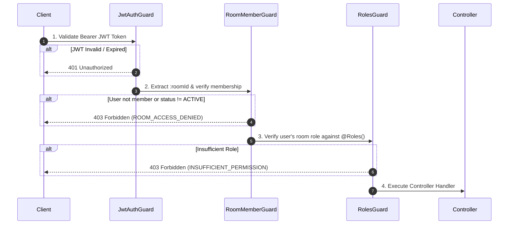

# HisaabSync - Role-Based Access Control (RBAC) Design v1

## 1. Multi-Tenant Room-Level RBAC Overview

HisaabSync uses **Room-Level Role-Based Access Control (RBAC)**. 
A user has no universal administrative privileges; roles are evaluated **strictly within the context of a specific room**.

### Role Definitions

| Role | Responsibility | Scope |
|---|---|---|
| **ADMIN** | Room owner and coordinator. Full management over room settings, memberships, roles, and financial approvals. | Room-level authority. Can manage roles of members and accountants. |
| **ACCOUNTANT** | Room treasurer. Manages financial operations: approving contributions, approving expenses, recording reimbursement payouts, and managing categories. | Cannot alter room ownership, kick members, or change core room settings. |
| **MEMBER** | Room participant. Submits contributions, logs shared out-of-pocket expenses, views treasury balance/ledger, and tracks reimbursements. | Cannot approve financial records or alter room configuration. |

---

## 2. Complete Permission Matrix

| Module / Action | ADMIN | ACCOUNTANT | MEMBER | Precondition / Constraint |
|---|:---:|:---:|:---:|---|
| **Room Management** | | | | |
| Create Room | ✅ | ✅ | ✅ | Any authenticated user |
| View Room Details | ✅ | ✅ | ✅ | Must be ACTIVE member of room |
| Update Room Info & Settings | ✅ | ❌ | ❌ | Admin only |
| Archive Room | ✅ | ❌ | ❌ | Freezes future transactions |
| Request Leave Room | ✅ | ✅ | ✅ | Last Admin must transfer ownership first |
| Approve / Reject Leave Request | ✅ | ❌ | ❌ | Admin only |
| **Member Management** | | | | |
| View Member List | ✅ | ✅ | ✅ | Active room members |
| Approve / Reject Join Request | ✅ | ❌ | ❌ | Admin only |
| Change Member Role | ✅ | ❌ | ❌ | Cannot demote last Admin |
| Kick / Remove Member | ✅ | ❌ | ❌ | Admin only; cannot kick self |
| **Category Management** | | | | |
| View Expense Categories | ✅ | ✅ | ✅ | Active room members |
| Create / Update Category | ✅ | ✅ | ❌ | Admin or Accountant |
| Delete Category | ✅ | ❌ | ❌ | Admin only |
| **Contributions** | | | | |
| Submit Contribution | ✅ | ✅ | ✅ | Active room members |
| Cancel Own Pending Contribution | ✅ | ✅ | ✅ | Creator only; status must be `PENDING` |
| View Contributions | ✅ | ✅ | ✅ | Active room members |
| Approve / Reject Contribution | ✅ | ✅ | ❌ | Admin or Accountant |
| **Expenses** | | | | |
| Submit Expense | ✅ | ✅ | ✅ | Active room members |
| Cancel Own Pending Expense | ✅ | ✅ | ✅ | Creator only; status must be `PENDING` |
| View Expenses & Receipts | ✅ | ✅ | ✅ | Active room members |
| Approve / Reject Expense | ✅ | ✅ | ❌ | Admin or Accountant |
| **Reimbursements** | | | | |
| View Reimbursements | ✅ | ✅ | ✅ | Active room members |
| Mark Reimbursement Paid | ✅ | ✅ | ❌ | Checks balance in Strict Mode |
| **Treasury & Ledger** | | | | |
| View Treasury Balance & Ledger | ✅ | ✅ | ✅ | Active room members |
| Record Manual Adjustment | ✅ | ❌ | ❌ | Admin only with mandatory audit note |
| **Activity & Audit** | | | | |
| View Room Activity Feed | ✅ | ✅ | ✅ | Active room members |
| View Detailed Audit Logs | ✅ | ❌ | ❌ | Admin only |

---

## 3. NestJS RBAC Implementation Architecture

The RBAC guard pipeline executes in strict chronological order:



### NestJS Decorators & Guards Usage Example

```ts
@ApiTags('Expenses')
@Controller('rooms/:roomId/expenses')
@UseGuards(JwtAuthGuard, RoomMemberGuard, RolesGuard)
export class ExpenseController {

  @Post()
  @Roles(Role.ADMIN, Role.ACCOUNTANT, Role.MEMBER)
  async submitExpense(
    @CurrentRoom() room: RoomContext,
    @CurrentUser() user: UserPayload,
    @Body() dto: SubmitExpenseDto,
  ) {
    return this.expenseService.submit(room.id, user.id, dto);
  }

  @Patch(':id/approve')
  @Roles(Role.ADMIN, Role.ACCOUNTANT)
  async approveExpense(
    @CurrentRoom() room: RoomContext,
    @CurrentUser() user: UserPayload,
    @Param('id') expenseId: string,
  ) {
    return this.expenseService.approve(room.id, expenseId, user.id);
  }
}
```

---

## 4. Key Security Invariants

1. **Room Context Isolation**: Every request to `/rooms/:roomId/*` resolves membership solely from `(room_id, user_id)` in `room_members`. A user who is `ADMIN` in Room A cannot execute admin operations in Room B where they are `MEMBER`.
2. **Active Status Requirement**: Even if a membership record exists, if `status !== 'ACTIVE'` (e.g. `PENDING_APPROVAL` or `LEFT`), access is immediately denied.
3. **Last Admin Protection**: The system will throw `ROOM_LAST_ADMIN_CANNOT_LEAVE` if the sole admin attempts to leave or self-demote without appointing a new admin first.
