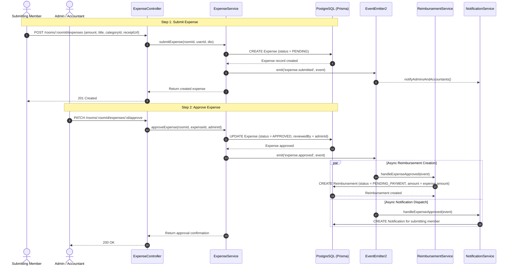
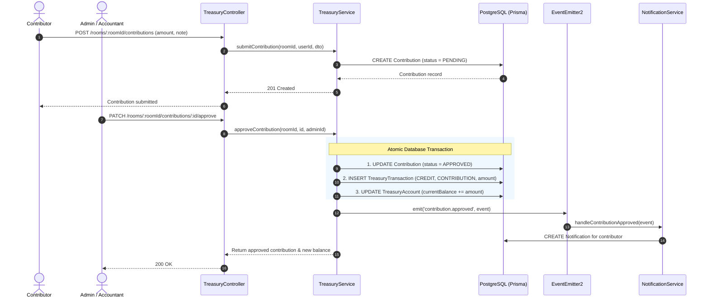
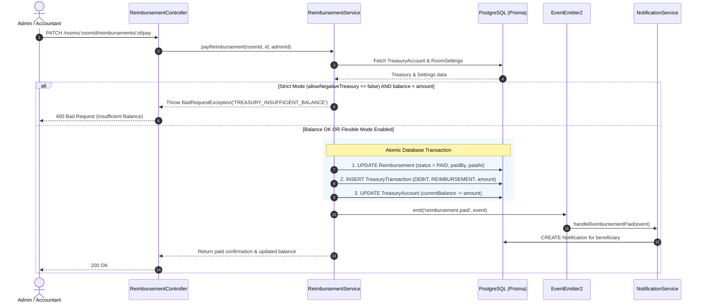
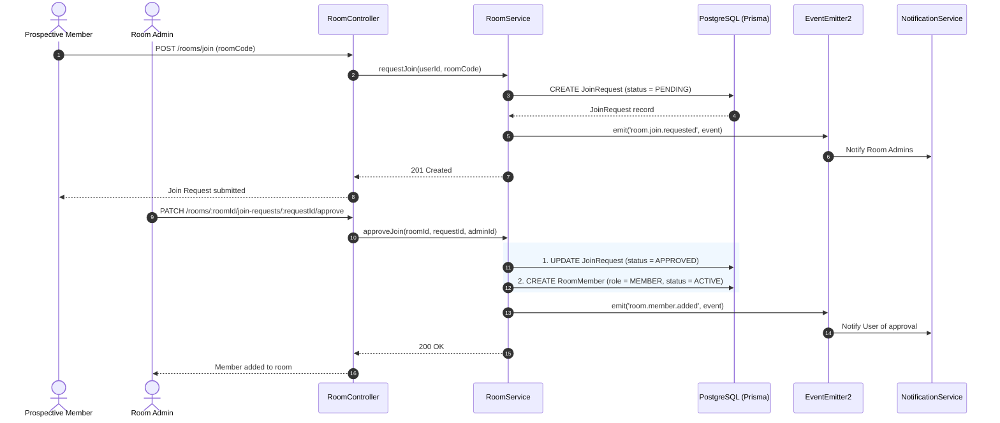
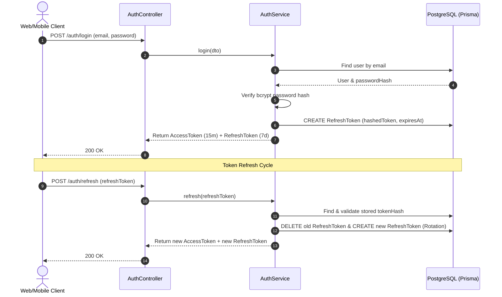

# HisaabSync - Sequence Diagrams v1

## 1. Expense Submission & Approval Flow

---

## 2. Contribution Submission & Approval Flow

---

## 3. Reimbursement Payout Flow (Strict vs Flexible Treasury)

---

## 4. Room Join Request & Approval Flow

---

## 5. Authentication & Token Refresh Flow

